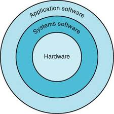

# Chapter1 :

## 프로그램 성능의 이해
프로그램의 성능은 알고리즘의 효율성과 프로그램을 생성하고 기계어로 변역하는 데 사용된 소프트웨어 시스템, 입출력 작업을 포함하여 번역된 명령어를 실행하는 컴퓨터의 효율성에 의해 결정된다.

| 하드웨어 또는 소프트웨어 구성 요소    | 성능에 미치는 영향                      |
|------------------------|---------------------------------|
| 알고리즘                   | 소스 프로그램 문장 수와 입출력 작업 수를 결정      |
| 프로그래밍 언어, 컴파일러, 컴퓨터 구조 | 각 소스 프로그램 문장에 해당하는 기계어 명령어 수 결정 |
| 프로세서와 메모리 시스템          | 명령어의 실행 속도 결정                   |
| 입출력 시스템(하드웨어 및 운영체제)   | 입출력 작업의 실행 속도 결정                |

## 컴퓨터 구조 분야의 8가지 위대한 아이디어
- Moore`s law : 반도체 집적회로의 성능이 24개월마다 2배로 증가한다는 법칙이다. 경험적인 관찰에 바탕을 두고 있다. 인텔의 공동 설립자인 고든 무어가 1965년에 내 놓은 것이다.

- Abstraction : 컴퓨터 설계자와 프로그래머는 무어의 법칙에 따라 자원의 수가 급격히 증가함에 따라 설계 시간이 길어지는 것을 방지하기 위해 생산성을 높이기 위한 기술을 개발해야 했다. 하드웨어와 스프트웨어의 생산성을 높이는 핵심 기술 중 하나는 여러 수준에서 설계를 명시하는 추상화를 사용하는 것이다.
- Common Case Fast : 자주 생기는 일을 빠르게 만드는 것이 드물게 생기는 일을 최적화하는 것보다 성능 개선에 도움이 됨
- Parallelism : 작업을 병렬적으로 수행하여 성능을 높이기
- Pipelining : 파이프라인이 있다면 더 빠른 처리가 가능하다.
- Prediction : 예측을 해서 미리 일을 수행 하는 것이 평균적으로 빠른 경우가 종종 있다.
- Hierarchy : 메모리 속도가 성능을 좌우하고, 메모리의 크기가 풀 수 있는 문제의 크기를 제한한다. 따라서 그 중요한 메모리를 컴퓨터 설계자는 이런 상충되는 요구를 메모리 계층 구조로 해결한다. (ex. 최상위 계층에는 비트당 가격이 비싸지만 작고 빠른 메모리를 사용하고 최하위 계층은 그에 반대이다.)
- Dependability : 컴퓨터는 빠르기만 해선 안된다. 모든 디바이스가 장애가 발생할 수 있으므로, 장애를 감지하고 장애가 난 디바이스를 대치할 수 있도록 여유분을 준비하면 컴퓨터의 신용도를 개선할 수 있다.

## 소프트웨어

복잡한 응용의 경우는 응용 소프트웨어 자체가 여러 층으로 구성될 수 있다.  

시스템 소프트웨어 핵심 두 가지
- 운영체제 : 사용자 프로그램과 하드웨어 간의 인터페이스 역할을 하면서 각종 서비스와 감독 기능 제공
    1. 기본적 입출력 작업의 처리
    2. 보조기억장치 및 메모리 할당
    3. 컴퓨터를 동시에 사용하는 여러 응용들 간의 컴퓨터 공유 방법 제공
- 컴파일러 : 상위 수준 언어로 작성된 프로그램을 하드웨어가 실행할 수 있는 명령어로 번역하는 일을 함.

어셈블리 언어 : 사람이 생각하는 것과 비슷한 새로운 표시방법을 고안한 게, 어셈블리 언어다. 일일이 이진수 번역이 아닌, 기호식 표현을 이진수로 바꾸는 프로그램을 말한다.  

 

*상위 수준 언어의 몇 가지 중요한 장점*
- 일반 문장과 훨씬 비슷하게 읽기 좋은 모양이다. (사용 목적에 적합한 언어가 다양하게 설계될 수 있다.)
- 프로그래머의 생산성을 높여준다. (개발시간 단축)
- 개발한 기종과 상관없이 어느 컴퓨터에서든 실행이 가능 (컴파일러나 어셈블러가 상위 수준 언어 프로개름을 어떤 컴퓨터의 기계어로도 번역이 가능하기 때문)

## 하드웨어
모든 컴퓨터의 하드웨어는 네 가지 기본 기능을 수행함.
- 데이터 입력
- 데이터 출력
- 데이터 처리
- 데이터 저장

컴퓨터 고전적 구성 요소
- 입력
- 출력
- 메모리
- 프로세스(데이터패스, 제어 유닛)

하드웨어 용어 정리
- 집적회로 칩 : 수천 만개의 트랜지스터가 결합된 부품
- CPU : 프로세서라고도 부름. 데이터패스와 제어 유닛으로 구성된 컴퓨터의 핵심 (숫자를 더하거나 검사하고, 입출력 장치에 신호를 보내 활성화하는 일을 함)
- 데이터패스 : 산술 연산을 수행하는 프로세서 구성 요소
- 제어유닛 : 프로그램의 명령어에 따라 데이터패스, 메모리, 입출력 장치에 지시를 하는 프로세서 구성 요소
- 메모리(DRAM) : 실행 중인 프로그램과 프로그램이 필요하는 데이터를 기억 (메모리는 DRAM 칩으로 구성)
- 캐시 메모리(SRAM) : DRAM 의 버퍼 역할을 하는 작고 빠른 메모리
- 명령어 집합 구조 : 하드웨어와 최하위 소프트웨어 간의 추상화 한 인터페이스
- ABI : 응용 프로그래머에게 제공되는 기본 명령어 집합과 운영체제 인터페잇를 합쳐서 일컫는 말

### 데이터의 안전한 저장소
휘발성 메모리(메인메모리) : DRAM 과 같이 전원이 공급되는 동안만 데이터를 기억하는 기억 장치
비휘발성 메모리(보조기억장치) : 전원 공급이 끊어져도 데이터를 계속 기억하는 기억 장치(ex. DVD)

### 컴퓨터 간의 통신
네트워킹 기술은 발달되어 메모리나, 마이크로프로세서와 똑같이 값싼 반도체 기술을 사용해서 무선 장비를 만들 수 있게 되면서 가격이 급속히 하락하고 무선망 보급이 폭팔적으로 늘어났다.  
현재 쓰이고 있는 무선 기술은 IEEE 802.11 표준으로 1~100Mbps 의 속도로 데이터를 전송 가능하다.

## 프로세서와 메모리 생산 기술
믿기 어려울 정도로 프로세서와 메모리는 믿기 어려울 정도로 빠르게 개선됐다.  
트랜지스터는 한 마디로 전기로 제어되는 온/오프 스위치다. 집적회로는 수십, 수백 개의 트랜지스터를 칩 하나에 집적 시킨 것이다.  

*집적회로 제조 공정*

- 실리콘 괴를 자른다.
- 20내지 40단계의 공정을 거쳐 빈 웨이퍼에 패턴이 새겨진다.
- 패턴이 새겨진 웨이퍼를 웨이퍼 검사기로 검사해 불량 부분에 표시한다.
- 이 웨이퍼를 잘라서 다이를 만든다.
- 한 웨이퍼에서 20개의 다이가 만들어지고
- 그 중에 17개만이 검사 통과되었다면,
- 이 다이의 수율은 17/20, 즉 85%이다.
- 검사를 통과한 다이는 패키지에 붙이고, 남풉하기 전에 다시 재검사한다.
- 즉, 이 과정은 불량 판정을 받은 것이다.

집적회로의 가격은 3가지 간단한 식으로 표현이 가능하다.
- 다이원가 : 웨이퍼당 가격 / 웨이퍼당 다이의 수 * 수율
- 웨이퍼당 다이의 수 [근사치] 웨이퍼의 면적/ 다이의 면적
- 수율 = 1 / 1 + (면적당 결함의 수 * 다이의 면적 / 2) 의 제곱

## 성능
용어 정리
- 응답시간(실행시간) : 컴퓨터가 태스크를 완료하기까지의 총 소요시간(디스크 접근, 메모리 접근, 입출력 작업, 운영체제 오버헤드 및 CPU 시간 등 다 포함)
- 처리량(대역폭) : 단위 시간 당 완료하는 태스크의 수를 나타내는 또 다른 성능 척도

응답 시간을 단축시키면, 거의 대부분 처리량은 좋아진다.  
성능을 최대ㅗ하하기 위해서는 어떤 태스크의 응답시간 또는 실행시간을 최소화해야 한다.

### 성능의 측정
컴퓨터를 공유하는 경우, 프로세서 하나가 여러 프로그램을 동시에 실행하는 경우가 많다.  
이런 환경에서는 특정 프로그램의 경과시간을 최소화하는 것보다 처리량을 최적화하는 것이 중요하다.  
 
그러므로 경과시간과 구분해서 프로세서가 순수하게 이 프로그램을 실행하기 위해 소비한 시간을 계산할 필요가 있다. 이를 CPU 시간이라 한다.  
단, 입출력에 걸린 시간이나 다른 프로그램을 실행하는 데 걸린 시간이 여기에 포함되지 않음. 
 

CPU 시간을 두 가지로 나누기
- 사용자 CPU 시간 : 실제로 사용자 프로그램 실행에 소요된 사용 CPU 시간
- 시스템 CPU 시간 : 운영체제가 이 프로그램을 위한 작업을 수행하기 위해 소비한 시스템 CPU 시간

이 두 가지를 구분하기는 쉽지 않다.

### 다른 성능의 척도를 비교
다른 성능 척도를 사용하는 것이 편리할 때가 있다. 
거의 모든 컴퓨터는 하드웨어 이벤트가 발생하는 시점을 결정하는 클럭을 이용하여 만들어진다.  
 

클럭(clock)이란 CPU의 속도를 나타내는 단위입니다. 클럭은 1초 동안 파장이 한 번 움직이는 시간을 의미하는데, 이 시간 동안 처리하는 데이터 양에 따라 CPU의 속도가 달라지게 된다.

과거, CPU의 성능을 높이는 가장 편리한 방법은 클럭(동작 주파수)를 올리는 것이었습니다. 하지만 클럭이 높아질수록 발열량과 소비 전력이 커지는 문제가 발생하였습니다. 따라서 최근에는 클럭을 일정 수준으로 유지하는 대신, ‘멀티 코어’나 ‘멀티 스레드’ 같은 방식으로 CPU 성능을 높이고 있습니다. 이를 통해 하나의 CPU로 동시에 처리할 수 있는 연산 개수를 늘려 연산 능력 향상을 꾀하는 것입니다.

### CPU 성능과 성능 인자
클럭 사이클 수와 클럭 사이클 시간으로 CPU 시간을 표시할 수 있다.  

프로그램 CPU 실행시간을 구하는 공식 
- 프로그램 CPU 클럭 사이클 수 * 클럭 사이클 시간
- 프로그램 CPU 클럭 사이클 수 / 클럭 속도

### 명령어 성능
앞에 말한 실행 시간은 프로그램의 명령어 수와 관련이 있다. 이런 관점에서 실행 시간을 실행 명령어 수에 명령어의 평균 실행 시간을 곱한 값으로 계산할 수 있다.

CPU 클럭 사이클 수 
- 명령어 수 * 명령어 당 평균 클럭 사이클 수(CPI)

또한, 명령어마다 실행 시간이 다르므로 CPI 는 프로그램이 실행한 모든 명령어에 대해 평균 값을 ㅗ사용 함.

### 고전적인 CPU 성능식
프로그램 CPU 시간 실행시간 구하는 공식
- 명령어 수 * CPI * 클럭 사이클 시간
- 명령어 수 * CPI / 클럭 속도

## 전력 장벽

속도와 전력이 같이 증가하는 이뉴는 둘이 서로 연관되어 있기 때문이다.  
최근 성장이 정체된 이유는 상용 마이크로프로세서의 냉각 문제 때문이다.  
전력이 냉각의 한계를 정하기는 하지만, 포스트 PC 시대에선 실제로 더 중요한 자원은 에너지다.  
 
개인 휴대용 기기는 배터리 수명이 성능보다 더 중요한 역할을 한다.
> 전력을 높이면 열이 받아 성능이 떨어지고, 낮추면 클럭속도가 느려진다. 즉 trade-off 관계이다.

## 단일프로세서에서 멀티프로세서로
프로세서 하나로 한계를 느꼈다. 그래서 여러 개의 프로세서를 집적한 마이크로프로세서를 생산했다.  
이는 응답시간보다는 처리량 개선에 더 효과가 있다.  
 
이러한 여러 개의 프로세서(코어)를 가지고 실행하느 병렬성 컴퓨팅이라고 하는데, 이건 명령어 수준에서의 것으로 하드웨어가 실행하기 때문에 프로그래머에게는 보이지 않는다. 
병령 프로그램 작성은 어렵다. 왜 어렵나?
- 정의상 성능을 중시하는 프로그래밍이고, 프로그램이 정확하고, 중요한 문제를 해결하며, 실행시간이 빨라야하기 때문이다.(이해 안됨)
- 병렬 하드웨어에서 빠르게 수행된다는 것은 각 프로세서가 대략 비슷한 양의 일을 동시에 수행하도록 응용을 분할해야 한다. 이렇게 부하를 공평하게 분배하는 것도 어렵다.

