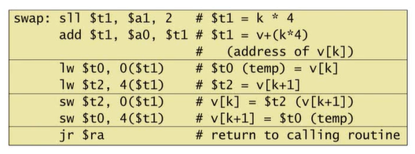
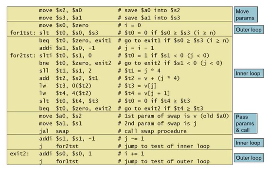
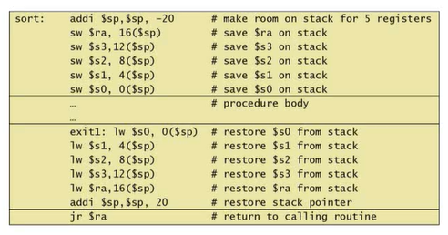
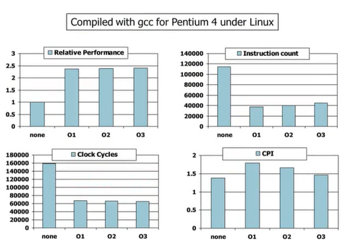
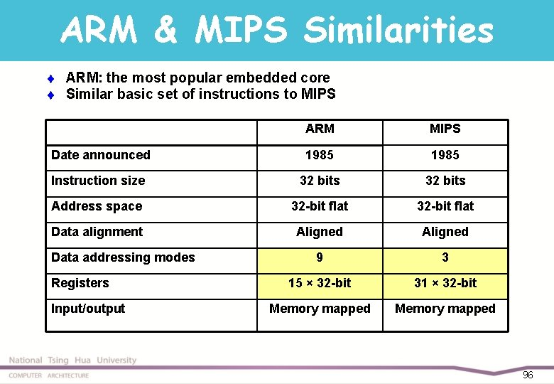
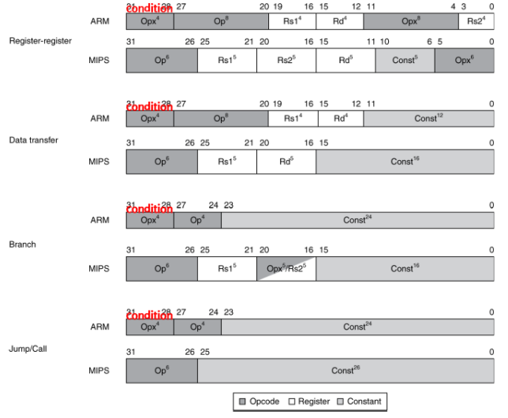
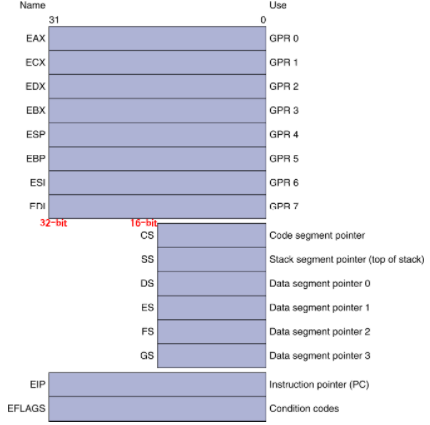
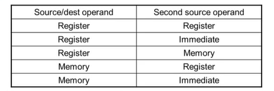
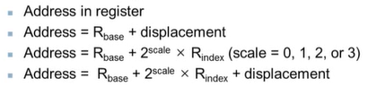
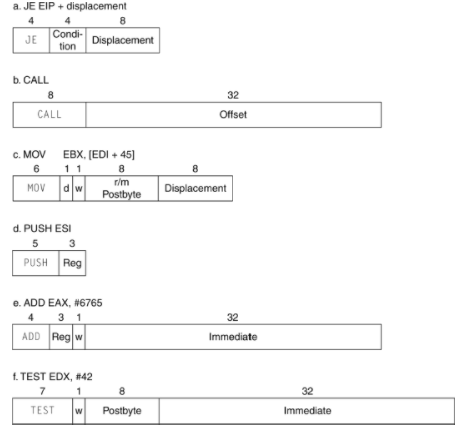

# 2장. 명령어 : 컴퓨터 언어(3)
## 1. C 정렬 프로그램
앞에서 설명한 내용만 알고 있다면, 완전히 어셈블리 프로그램의 형태를 파악하지 못할 위험이 있다.<br>
그래서 두 가지 추가로 설명하겠다.
- 배열 원소 두 개를 맞바꾸는 것 (swap)
- 배열 원소를 정렬하는 것 (sort)


### *C 프로그램 -> 어셈블리 프로그램 바뀌는 절차*
- 프로그램 변수에 레지스터를 할당한다.
- 프로시저 본체에 해당하는 코드를 생성한다.
- 프로시저 호출 후의 레지스터 내용을 호출 전과 같도록 만든다.
### 1-1) 프로시저 Swap
**[ C언어 ]**

```shell
void swap(int v[], int k) {
   int temp;
   temp = v[k];
   v[k] = v[k+1];
   v[k+1] = temp;
}
```
**[ MIPS 어셈블리코드 ]**



### 1-2) 프로시저 Sort

**[ C언어 ]**

```shell
void sort (int v[], int n) {
    int i, j;

    for(i = 0; i < n; i += 1) {
        for(j = i - 1; j >= 0 && v[j] > v[j + 1]; j -= 1) {
            swap(v, j);
        }
    }
}
```
**[ MIPS 어셈블리코드 ]**




---


## 2. 컴파일러 

### 2-1) 컴파일
컴파일러는 컴퓨터의 성능에 지대한 영향을 미치기 때문에 컴파일러 기술을 이해하는 것은 성능을 이해하는 데 필수적이다. <br>



o1 o2 o3 의 경우, 숫자가 높을수록 최적화를 많이 한 경우다.
- 각 최적화 한 경우의 상대 능력 평가
- 명령어 수
- 클럭 사이클 수
- CPI (Clock Cycle per Instruction) 또는 Clock speed(사이클의 각 단계를 수행하는 속도)

> 퍼포먼스와 명령어 수, 클럭 사이클은 반비례 관계이다. <br>
> 또한, 명령어 수를 보면 o3 가 o1보다 명령어 수가 많은데도 상대능력 평가가 o3 가 좋은 이유는, CPI 가 o1 보다 o3 가 작기 때문이다.

<br>

### 2-2) 버블 정렬을 서로 다른 언어로 구현 후 성능 비교
기본적으로 Java가 C보다 느리다. <br>
특히 인터프리터 방식의 Java는 성능차이가 많이 났으나 JIT 컴파일러의 발전으로 성능차이를 많이 따라잡았다.
> 인터프리터는 line by line으로, JIT 컴파일러는 chunck 단위로

<br>

### 2-3) 내용 정리
- 명령어 수와 CPI 는 좋은 성능 지표가 아니다. 즉, 종합적으로 봐야한다는 것
- 컴파일러의 최적화는 알고리즘에 의존한다.
- 자바는 JIT(Just In Time)은 JVM 보다 빠르다.
- 정리하자면 아무리 컴파일러가 좋고, 시스템이 좋더라도 알고리즘이 가장 중요하다.

<br>

## 3. Array VS Pointer
- Pointer 가 실행해야 할 명령어 수가 적기 때문에 Array 를 사용하는 것보다 성능이 좋다.
- 하지만, 최신 컴파일러는 Array 의 성능이 Pointer 와 비슷하다. 따라서, Pointer 보다 Array 를 사용하자
- Array 를 사용하면 이해하기 쉽고, 오류발생 확률이 적다.

<br>

## 4. ARM Instruction
ARM : 임베디드 시스템에서 가장 많이 사용하고 MIPS 와 많이 유사하다 <br>



### 4-1) ARM 프로세서의 가장 큰 특징
- 산술/논리 연산을 실행하면, 그 결과에 대한 조건을 사용할 수 있다.
  - Negative, zero, carry, overflow
  - 결과를 보존하기보다는 condition code 에 넣어 compare instruction 에 사용
- 각 명령어가 conditional 이 될 수 있다.
  - instruction 의 최상위 4비트를 condition 값으로 둠
  - 단일 instruction 만으로도 branch 구문 없이 조건적인 동작 가능하다.
> ARM 의 큰 특징으로 명령어 수를 줄일 수 있다. 왜냐? 그 결과를 조건으로 사용할수 있으니 그렇다.

<br>

아래 사진은 ARM과 MIPS의 명령어 형식을 나타냈다. <br>
차이는 구조가 16개의 레지스터를 갖느냐, 32개의 레지스터를 갖느냐에 기인한다.



## 5. Intel x86 Instruction
인텔은 35년 이상 계속 발전 해왔다.<br>
- 8080(1974) : 8-bit 마이크로프로세서
- 8086(1978) : 8080으로부터 16-bit 확장
- 8087(1980) : floating-point corprocessor
- 80286(1982) : 24-bit addresses, MMU 포함
- 80386(1985) : 32-bit extension -> IA-32
- i486(1989)
- Pentium(1993)
- Pentium Pro(1995)
- Pentium III(1999)
- Pentium 4(2001)
- EM64T(2004)
- Intel Core(2006)
- Advanced Vector Extension(2008)

예전 프로그램들이 현재 인텔 프로세서에서 사용이가능해서, 현재도 수요가 많다.

### 5-1) Intel x86 VS MIPS

#### *MIPS 와 달리 레지스터의 길이가 동일하지 않다*



#### *Addressing Modes 도 복잡하다.*

*(x86 의 주소 표현 방식 : instruction 마다 2개의 operand 가 존재*



*Memory addressing models : 가장 큰 차이점은 일반적인 메모리에서 addressing 이 가능하다는 점이 있고, 아주 복잡하다.*



*x86 instruction Encoding* : 다양한 길이의 encoding(MIPS 는 명령어의 길이가 32bit 로 고정), 가변적이다.




### 5-2) Implementing IA-32
CISC : Complex Instruction Set Computer
- 복잡한 Instruction set 은 implementation 을 어렵게한다. 따라서, 하드웨어가 명령어를 간단하게 microoperations(여러개의 명령어) 로 나눠준다.
- RISC 와 비슷한 마이크로 엔진을 가지고 있다. (마이크로 오퍼레이션을 마이크로 엔진에서 구동한다.)
- 비용이 들지만, 시장 점유율 덕분에 경제적으로 실현 가능함
- RISC 와 견줄만한 성능을 낸다 (컴파일러가 복잡한 명령어를 해결 함)
> Intel 프로세서는 겉은 CISC 지만, 속은 RISC 와 같다.<br>
> CISC instruction 을 RISC 방식의 microoperation 으로 나누어 오버헤드를 제외하며 내부적인 성능은 RISC 와 유사하다.

## 6. Fallacies and Pitfalls
### 6-1) 오류
Powerful instruction (하나의 명령어가 여러 동작을 한 번에 수행)이 고성능으로 이어질까? 정답은 그렇지 않다.
- 구현을 어렵게 만든다.
- 여러 일을 동시에 하는 명령어를 실행하기 위해 느린 clock 을 사용해야 하고 이로인해 모든 명령어가 느려짐.
- 컴파일러는 powerful instruction 보다 simple instruction 으로 만들어진 코드에서 더 빠르게 동작함.

고성능을 위해 어셈블리 코드를 사용해야할까? 정답은 아니다.
- 현대 컴파일러는 최적화를 잘 시켜주기 때문에 High Level Language 도 어셈블리 코드와 유사한 성능으로 이끈다.
- 오히려 어셈블리 코드로 인한 line 수 증가, 생산성 저하, 많은 오류가 생긴다.
- 단, 임베디드 시스템과 같은 특수한 경우엔 어셈블리 코드를 사용해야 할 상황이 생긴다.

하위 호환성(backward compatibility = 예전 것을 새로운 환경에서도 지원) 을 유지하려면 instruction set 은 바꿀수 없는가? 정답은 아니다.
- 하위 호환성을 유지한다는 것은 instruction set 을 바꾸지 않는다는 말이 아니다.
- 시간이 지남에 따라 명령어의 수가 증가하지만, 예전에 지원했던 명령어도 계속 사용이 가능하다.

### 6-2) 함정
- 시퀀셜 워드(4byte)와 시퀀셜 주소(1byte)는 다른 것이다.
- 함수가 끝난 후에, 그함수 에 있는 지역변수에 대한 어드레스를 포인터로 사용하면 안된다. why? 함수에서 지역변수는 스택에 저장되어있는데, 하지만 함수가 끝나면 할당받은 스택 메모리공간이 해제되기 때문이다.


