# 4장. 프로세서 (1)

## Introduction
CPU 의 퍼포먼스에 여향을 끼치는 요인은 크게 세 가지다.
- The number of instruction (명령어의 수)
- CPI (명령어 당 cycle)
- Clock period (클럭 사이클 시간) 

## 명령어 실행 과정

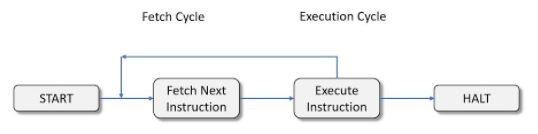
> Instruction Cycle = Fetch Cycle + Execute Cycle
- Fetch Cycle : 메모리로부터 명령어와 데이터를 프로세서로 가져오는 단계
- Execute : 프로세서가 수행하는 단계

### 세부적인 명령어 실행 구조
- Fetch : 명령어 주소를 계산하고 그 주소에 가서 명령어를 가져오는 단계 수행 (Fetch Cycle)
- Decode : 명령어 연산 디코딩을 통해 어떻게 수행, 행위 동작시킬지 결정
- Data fetch : operand 는 피연산자, 피연산자 위치를 계산해서 불러온다.
- Data process : 피연산자를 연산 합니다.
- Data store : 연산을 했으면 그 결과를 어디에 저장할 것인지에 대한 동작을 수행한다.

## CPU Overview

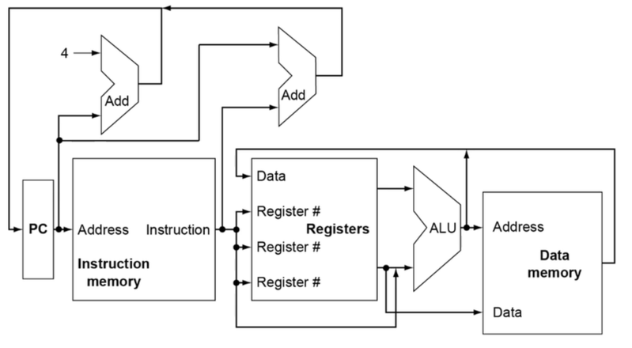

- Program counter
- Instruction memory
- Registers
- Data memory

하나의 소스에서 신호가 나눠 흐를 땐 문제가 되지 않는다.  
왜냐하면? 이미 그 신호의 값은 하나로 고정되었고 특별한 일이 일어나지 않는 이상 바뀔일이 없다. 
하지만, 두 개의 소스에서 저렇게 만나게 된다면 두 신호의 값이 다를 수 있고,  
이럴 경우 충돌이 발생해 원래 의도했던 목적지와는 다른 방향으로 전류가 흐르는 현상이 발생할 수 있다.  
 

이러한 상황을 미연에 방지하기 위하여 회로 입장에선 MUX, 멀티플렉스라 불리는 소자를 사용하여 해결합니다.
> 멀티플렉서?  
> 데이터 선택기라고도 하면서, 제어선의 값에 따라 여러 개 입력 중에서 하나를 선택한다. 제어선은 주로 실행중인 명령어에서 나오는 정보에 따라 설정된다.

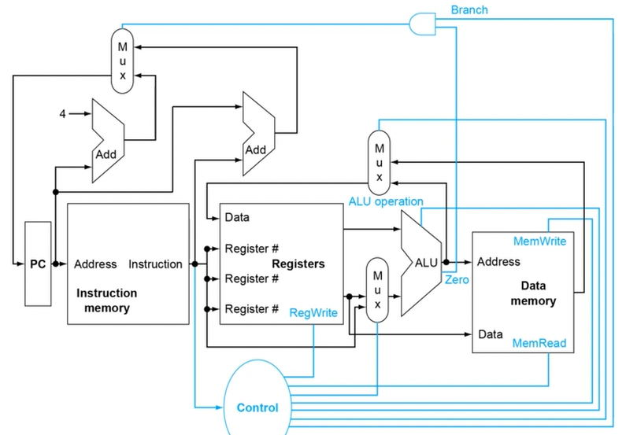

위 그림과 다르게 두 가지 다른 점이 존재한다.
- MUX : 위 설명
- Control : 각각의 모듈로직(Instruction memory, Registers, Data memory)를 제어하는 데 사용

위 그림에서 파란색으로 표시되어있는 부분이 컨트롤 로직의 요소들이다.

## 논리 회로
- 하드웨어 로직은 값이 2개 밖에 없다. (0 또는 1)
- 하나의 와이어엔 하나의 비트다
- 여러 데이터를 보내기 위해선, 여러 개의 와이어가 필요하다.

회로는 크게 두 종류로 나뉜다.

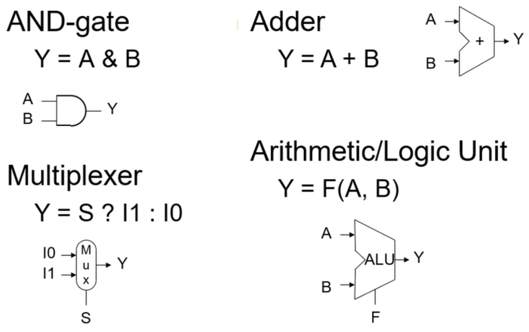
- Combinational element (조합소자)
  1. 데이터에 어떤 값이 좌우된다.
  2. 인풋에 의해 아웃풋이 결정된다.
  3. 우리가 알고있는 adder, multiplexor, AND-gate 등등 해당된다.

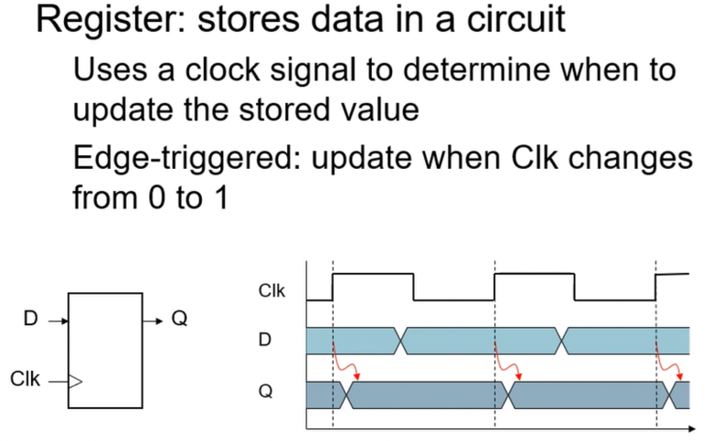
- State(sequential element) (상태소자)
  1. State 정보라는 게 존재하는데, 그 값에 따라서 다음 State 값이 변하게 된다. 
  2. 우리가 알고있는 register, cache memory, D램 등등 해당된다.
  3. 클럭에 동기화 되어있다. rising edge 때 값이 update 된다.
  
> 순차회로(sequential circuit)는 조합소자 + 상태소자로 구성됩니다.

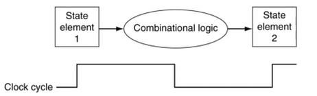

위 사진과 같은 식으로 순차회로 시스템이 구성되는 경우가 많다.  
이 때 시스템을 설계할 때, 상태 소자 값을 넘겨주거나 받을 시기를 positive edge 또는 negative edge 로 정해놓아서 설계를 하게된다.  
 
동기 시스템이라고 하는데 이렇게 하게 되면 훨씬 시스템의 설계가 간편해지고 업그레이드 또한 편하게 된다 

그리고 그러한 edge 부분을 담당하는 clock cycle frequency 같은 경우에는 조합회로에서 가장 오래걸리는 task 를 기준으로 결정된다.  

왜냐하면 clock cycle frequency 가 빨라버리면 조합회로의 동작을 온전히 담지 못할 수도 있기 때문이다.

### Clocking methodology (클러킹)
여러가지의 논리회로들은, 클럭 사이클 동안 데이터를 바꿔놓는다. 다른 말로 상태(state)를 바꿔놓는다.
- 각각의 클럭 엣지(Clock edge) 들 사이에 논리(logic)들이 들어간다.
- 이전 상태의 요소들을 입력으로 받고, 다음 상태의 요소들로써 출력으로 내보낸다.
- 가장 긴 지연시간(가장 긴 실행시간)이 클럭 주기가 된다.

## Data path (데이터 패스)
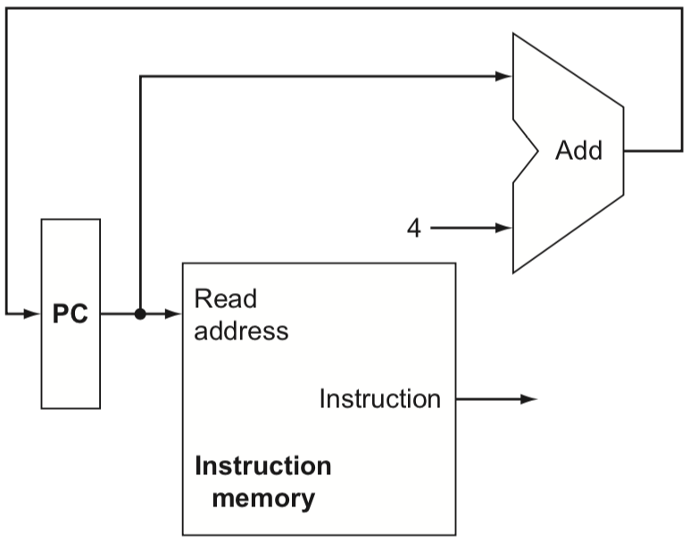

데이터들이 컴포넌트를 거치는 길(path) 라고 생각하면 됨.
- Data path : 데이터와 주소를 처리하는 CPU 의 요소들 (ex. register, ALU, multiplexor, memory 등등..)

 
위 그림을 설명하자면, 32bit PC 가 Instruction memory 컴포넌트로 read address 를 한 뒤, 명령 메모리에서 명령을 끄집어낸다(fetch) 그 후, 컴포넌트를 나간다.  
그리고 PC 에 4씩 더해주면서, 다음 명령어를 넘어간다. why? 워드(word)는 4Byte 단위이기 때문이다.

## R-Format Instructions (R-포맷 명령의 경우)
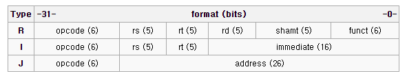

- 두 개의 오퍼랜드를 가지는 레지스터 2개와 연산 결과를 저장하는 레지스터 1개를 가리키는 명령어 구조
- 일반적으로 Arithmetic Operation 이나 Logic Operation 에 사용된다. (add, sub, mul, div, and, or 등)

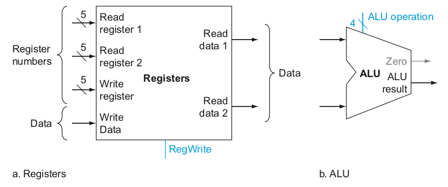

레지스터 간에 명령어이다.
- 두 개의 피연산자 레지스터를 읽어야 한다.
- 산술/논리 연산을 수행한다.
- 그리고 그 결과를 레지스터에 사용한다.

## Load / Store Instructions (불러오기 / 저장하기 명령)
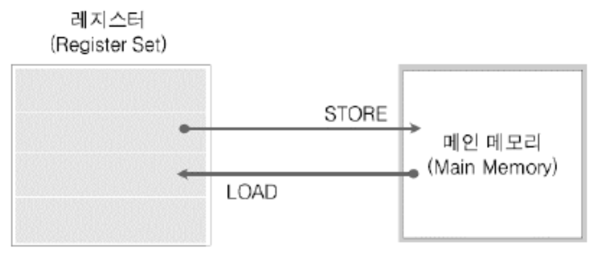

>load / store  
> 연산결과는 레지스터에 저장한다고 제약을 둔다. 
> 연산결과를 바로 메모리에 저장하면 더 좋을텐데 왜? 이게 안되지?  
> 그 이유는, CPU 의 모든 데이터는 레지스터를 통해서 밖으로 나가고/들어온다.  
> 레지스터는 임시 저장소일 뿐이다. 
> 그래서, 메모리에 일단 불러와야한다 => load  
> 일단 레지스터에 저장한 연산 결과를 메모리에 옮겨야 한다. => store  

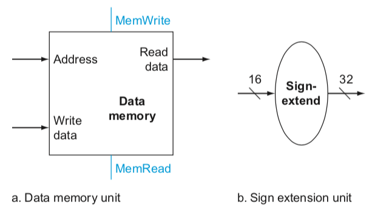

- 사칙연산의 피 연산자는 숫자 또는 레지스터가 올 수 있다.
- 연산 결과는 일단 레지스터에 저장해야한다 -> 즉 모든 연산은 레지스터를 통한다.
- 이러한 명령어의 제약사항 때문에 레지스터를 통해서 모든 연산을 진행해야 한다.

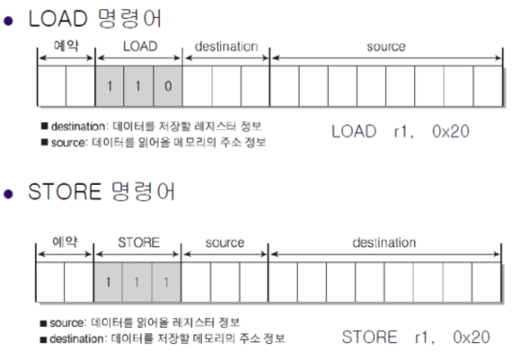

## Branch Instructions (분기 명령)
분기하다 : 프로그램의 실행 순서를 변경하여 다른 명령을 실행할 수 있게 하다

- 프로그램의 의사 결정 기능을 구현하는데 이용되는 명령어이다. (컴퓨터가 단순 계산기보다 훨씬 강력한 이유이다.)
- 프로그램의 실행 흐름을 프로그래머 임의로 바꾸는 명령어이다.
- Conditional Branch : 테스팅 결과에 따라 분기 여부를 결정하는 분기 명령어이다.
- Unconditional Branch : 무조건적으로 분기를 수행하는 분기 명령어이다.

- 피연산자 레지스터를 읽어와야 한다.
- 피연산자를 비교해야 한다. (operand 값을 계산한다.)
  - 이 때, ALU 로 값을 빼서, 'Zero' 의 값을 결정한다. 이 값에 따라서 분기를 할 지 말지 결정하게 된다.
- 목적지 주소를 계산해야한다.
  - 얼마나 움직일지(변위, displacement)를 부호 확장(Sign-extend)한다.
  - 왼쪽으로 2번 시프팅한다. (워드는 4 바이트이기 때문) 할당.
  - 그리고 PC + 4를 더해준다.
    - 하지만 이것은 이미 명령을 가져오면서(Instruction fetch) 계산(+4)되어 있다.
    
## R-Type / Load / Store DataPath
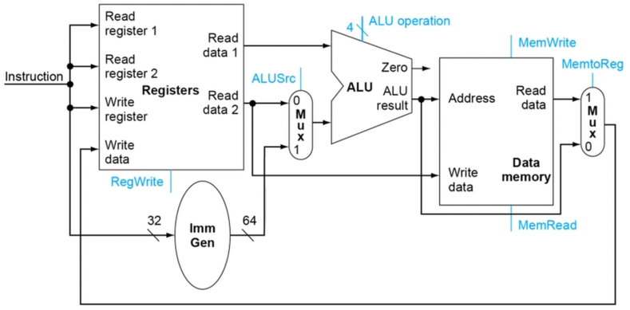

위에 설명한 명령을 합친 데이터 패스 그림이다.

## Full DataPath
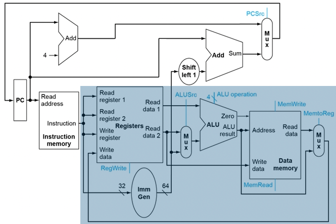

제어가 포함된 전체 데이터패스다.
