# 4장. 프로세서 (2)
오늘 배울 내용
- A Simple Implementation Scheme
- An Overview of Pipelining

## 1) ALU Control
ALU 컨트롤이 사용되는 곳
- Load / Store : F = add (더하기)
- Branch : F = subtract (빼기)
- R-type : F = depends on function field

### 1-1) ALU 제어 신호의 종류 6가지

- 워드 적재(lw), 워드 저장(sw) 인 경우에는 메모리 주소를 계산하기 위한 덧셈용으로 ALU 사용
- R type 명령어의 경우에는 명령어 하위 비트의 기능 필드 값에 따라 5가지 연산 중 하나, 같을 시 분기 명령어의 경우에는 ALU 뺼셈을 수행한다.

명령어의 기능 필드와 2bit 제어 필드(ALUOp) 를 입력으로 갖는 제어 유닛을 만들어서 4bit ALU 제어 입력을 발생시킬 수 있다.

### 1-2) ALUOp
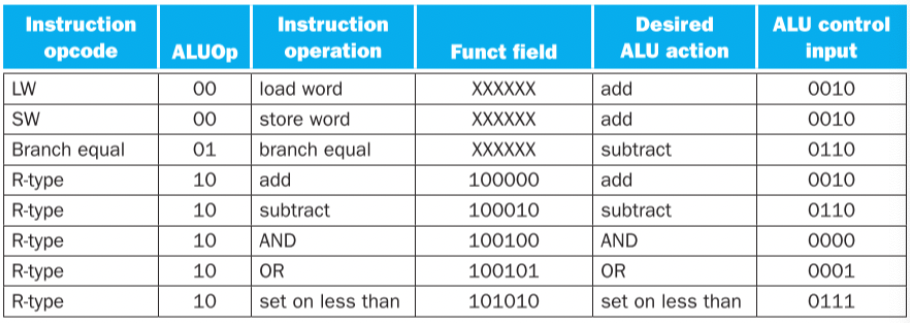
위 그림은 2비트 ALUOp 제어와 6비트 기능 코드를 사용하여 ALU 제어 입력을 만드는 지 보여주는 그림이다.
- 첫 번째 나열된 opcode 가 ALUOp 비트 값을 결정한다.
- 적재와 저장의 경우에는 덧셈 (00)
- beq 분기 의 경우에는 뺄셈 (01)
- 산술/논리의 연산의 경우에는 기능 필드에 나타내는 연산 (10)

> 주 제어 유닛이 ALUOp 비트를 생성하고, ALU 제어 유닛은 이것을 입력으로 받아서 ALU 를 제어하는 실제 신호를 만들어 내는 이런 다단계 디코딩은 많이쓰는 구현 기법이다.
 
 
### 1-3) 다단계 제어
- 다단계 제어를 사용하면, 주 제어 유닛의 크기를 줄일 수 있다.
- 여러 개의 작은 제어 유닛을 사용하는 것은 제어 유닛의 속도를 증가 시킬 수 있다.
- 2비트 ALUOp, 6비트 기능필드, 4비트 ALU 연산제어 로 구현하는 방법은 여러가지 존재한다.

### 1-4) 4비트 ALU 제어 신호를 위한 진리표
입력된 명령어에 따른 ALUOp 와 Function 필드에 따라 ALU 제어 신호를 생성한다.

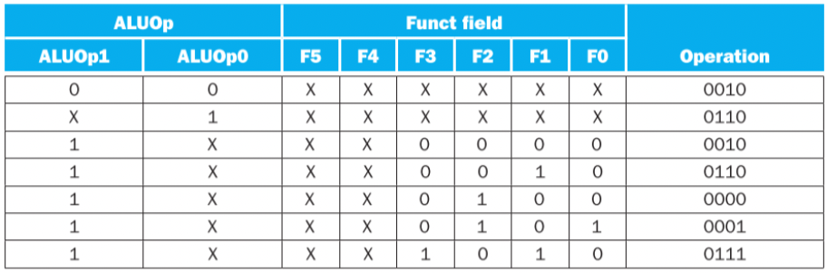

## 2) 주 제어 유닛의 설계
데이터패스에 필요한 명령어 필드와 제어선들을 알아내보자.  
명령어 필드들을 데이터패스에 연결하는 방법을 이해하기 위해서는 세 가지 명령어 종류,  
R-type 명령어, 분기 명령어, load/store 명령어 종류의 형식을 다시 살펴보자.

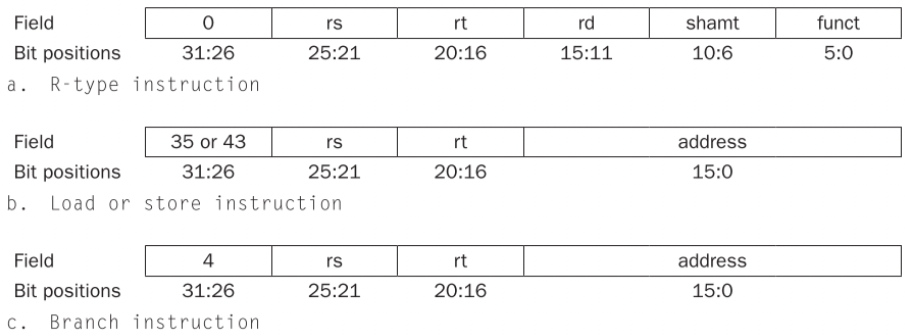

위 그림을 확인해보면, 세 가지의 명령어 종루는 두 가지 명령어 형식을 사용한다.

- opcode 라 불리는 op 필드는 항상 비트 31:26에 포함된다. 이 필드를 op[5:0]라고 부른다.
- 읽을 레지스터(rs,rt) 두 개는 항상 rs[25:21], rt[20:16] 필드에 의해 지정된다.
  - R형식, 같을 시 분기, 저장 명령어
- 기본 레지스터는 항상 rs(25:21)
  - 적재/저장 명령어
- 16비트 변위는 항상 address[15:0]
  - 같을 시 분기, 적재/저장 명령어
- 목적지 레지스터는 두 곳중 하나에 있다.

적재 명령어에는 비트 rt[20:16] 에 있고, R형식 명령어에는 rd[15:11] 에 있다.
따라서, 쓰기가 행해질 레지스터 번호로 명령어의 어느 필드를 사용하지 선택하기 위하여 멀티 플렉서를 추가해야한다.

## 3) 데이터패스의 제어신호
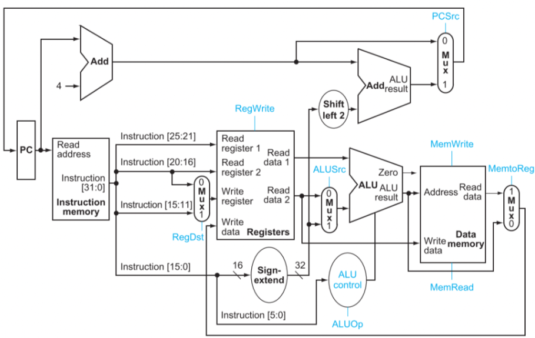
제어선들은 파란색으로 표시되었고, ALU 제어 블록이 추가되었다.  
PC 는 매 클럭 사이클 끝에 한 번씩 쓰기가 행해지므로 쓰기 제어신호가 필요 하지 않다.  
제어회로는 PC 에다 증가된 PC 값을 쓸 것인지 분기 목적지 주소를 쓸 것인지 결정한다.

### 3-1) 7개의 제어신호 기능
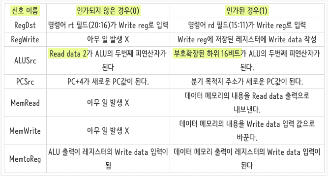
- 입력이 두 개인 멀티플레서의 1비트 제어신호가 인가되면,
- 멀티플레서는 1번 입력을 선택한다.
- 그렇지 않고, 제어가 인가되지 않으면?
- 멀티플레서는 0번 입력을 선택한다.
- 상태소자는 모두 클럭을 입력으로 가지고 있으며,
- 클럭은 쓰기를 제어하는데 사용된다.
- 또한 상태소자 외부에서 클럭을 연결하면 타이밍 문제를 일으킬 수 있다.

## 4) 데이터패스의 동작
각각의 명령어가 데이터패스를 어떻게 사용하는 지를 살펴보자.

1. R 형식 명령어의 실행과정 
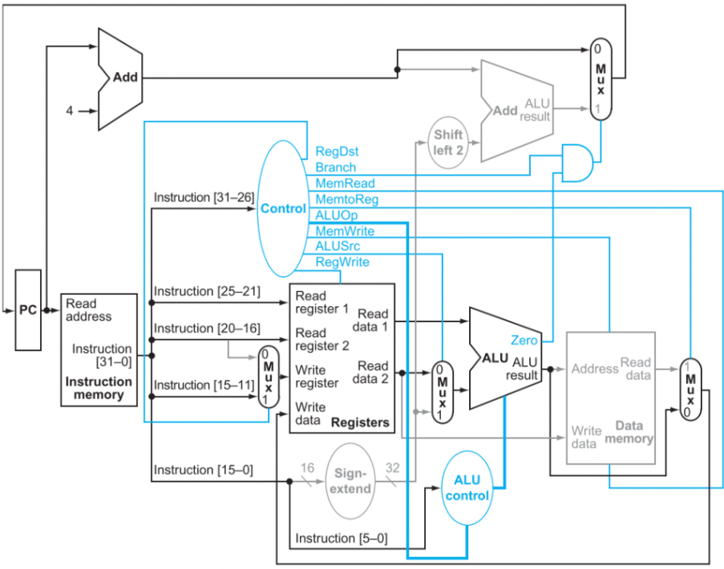
- 명령어 인출 및 PC 증가
- 두 Read register 의 값을 읽고, 해당 값을 계산
- ALU 는 읽어들인 값에 대한 연산 (funct 필드 값을 사용해 ALU 제어신호 생성)
- ALU 계산 결과를 Write reg 에 저장된 레지스터에 저장

2. 적재(lw) 명령어의 실행과정
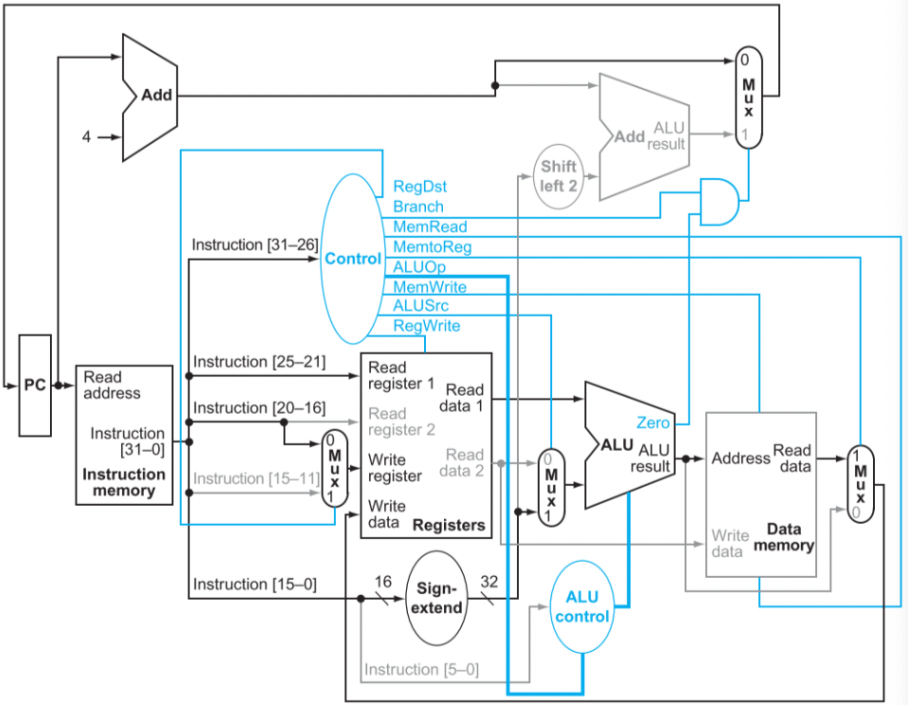
- 명령어 인출 및 PC 증가
- 두 Read register 의 값을 읽고, 해당 값을 계산
- 읽어들인 read reg 의 주소 값에 부호확장한 하위 16비트 값을 더해 유효주소 계산
- ALU 계산 결과를 주소로 사용해 데이터 메모리 읽기
- 가져온 데이터를 Write reg 에 저장

3. 분기(branch) 명령어의 실행 과정
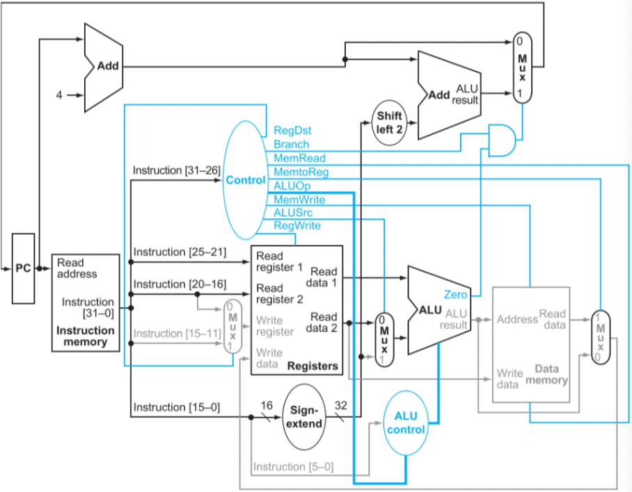
- 명령어 인출 및 PC 증가
- 두 Read register 의 값을 읽고, 해당 값을 계산
- ALU 에서 두 reg 값을 뺌, 별도의 주소 덧셈기는 하위 16비트 부호확장하고 자리이동 한 값과 PC + 4 더해 주소 계산
- ALU zero 출력 이용해 PC 에 넣을 값 선택

## 5) 제어유닛의 완성
이제까지 명령어들이 단계별로 어떻게 동작하는 지를 알아보았다.  
이제는 제어 유닛의 구현에 대해 알아보자.

- 제어 유닛의 입력은 6비트의 opcode 필드 (op[5:0])
- 제어 유닛의 출력은 제어선이다.

opcode 의 이진수 인코딩을 이용하여 각 출력의 진리표를 만들 수 있다.  
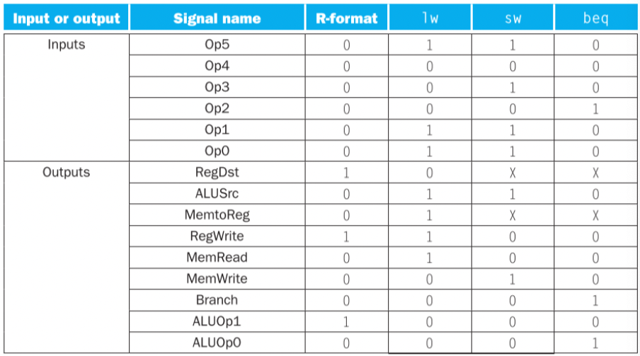
위 그림은 제어 유닛의 논리를 커다란 진료포 하나로 만든 것이다. 
이것은 제어 기능을 완벽하게 명시하며, 자동화된 방법을 이용하여 게이트로 곧바로 구현할 수 있다.

> 여기까지가, 단일 사이클 구현이다.(single-cycle implementation)

## 6) 왜? 단일 사이클 구현은 오늘날 사용하지 않는가?
비효율성 때문에 현대적 설계에서는 쓰이지 않는다.
- 단일 사이클 설계에서는 클럭 사이클이 모든 명령어에 대해 같은 길이를 가져야 하기 때문이다.
- 클럭 사이클이 너무 길기 때문에 전체 성능이 좋지 않다.

클럭 사이클은 모든 명령어에 대한 최악의 지연과 같다고 가정해야 하기 때문에, 흔한 경우의 지연은 줄여주지만   
최악의 경우 사이클 시간은 개선하지 못하는 구현은 소용이 없다. 
따라서, 단일 사이클 구현은 자주 생기는 일을 빠르게 하라는 1장의 핵심 설계 원칙에 위반이 된다.

> 파이프라이닝이라는 또 다른 구현 기술을 살펴 볼 것이다.  
> 단일 사이클 데이터패스와 매우 유사한 데이터패스를 사용하지만,  
> 처리율이 훨씬 크기 때문에 매우 효율적이다. 
> 파이프라이닝은 여러 개의 명령어를 동시에 실행하여 효율을 높인다.

## 7) 파이프라이닝
여러 명령어가 중첩되어 실행되는 구현 기술이다.  
오늘날 파이프라이닝은 아주 보편적인 기술이다.

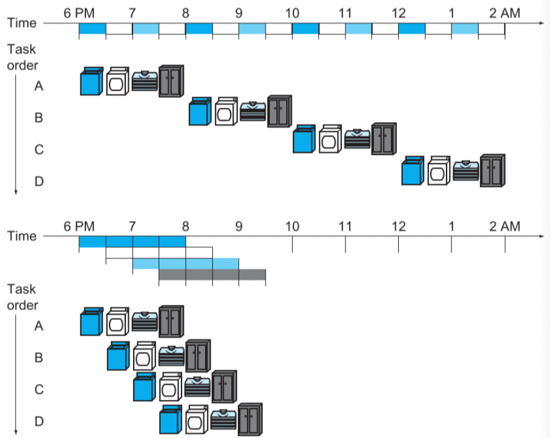
위 그림을 보고, 파이프라닝을 위한 세탁기 비유를 해보자.

세탁기 과정은
- 세탁기
- 건조기
- 개는 사람
- 넣는 사람

이렇게 각각 일하는데, 30분씩 걸린다  
순차 세탁소는 이 네 묶음의 빨래를 하는데 8시간이 소요된다  
하지만, 파이프라인 세탁소는 단지 3.5시간이 걸린다.

### 7-1) MIPS 명령어 파이프라이닝 프로세서를 적용
- 메모리에 명령어를 가져온다.
- 명령어를 해독하는 동시에 레지스터를 읽는다. MIPS 명령어는 형식이 규칙적이므로 읽기와 해독이 동시에 일어날 수 있다.
- 연산을 수행하거나 주소를 계산한다.
- 데이터 메모리에 있는 피연산자에 접근한다.
- 결과 값을 레지스터에 쓴다.

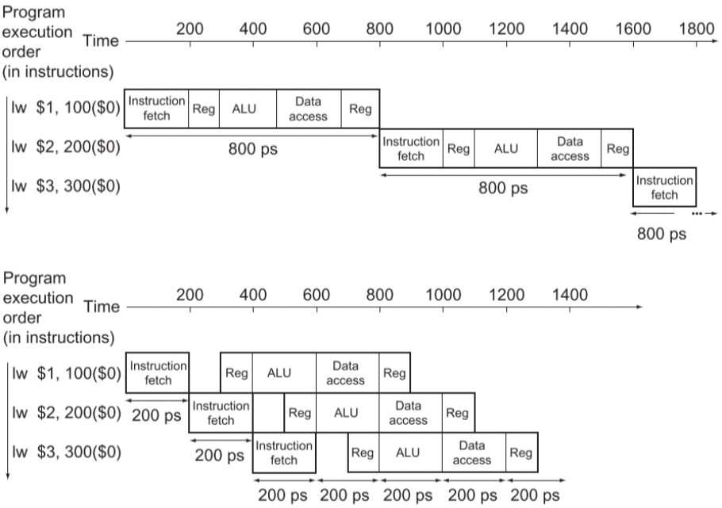

위 그림은 MIPS 파이프라인 5단계를 파이프라인으로 실행하는 것과 단일 사이클 실행하는 것과 비교한 그림이다.

위에서 설명한 속도 향상에 관한 논의를 식으로 바꿀 수 있다  

#### 명령어 사이의 시간(파이프라인) = 명령어 사이의 시간(파이프라이닝이 되지 않음) / 파이프 단계 수

> 실제 프로그램의 전체 실행시간의 비율은 명령어 사이의 시간 비율에 가깝다  
>  
> 파이프라이닝은 개별 명령어의 실행시간을 줄이지는 못하지만, 대신 명령어 철량을 증대시킴으로써 성능을 향상시킨다.

### 7-2) 파이프라이닝을 위한 명령어 집합 설계
MIPS 명령어 집합은 원래 파이프라인 실행을 위해 설계 되었다.

1. 모든 MIPS 명령어는 같은 길이를 갖는다.
   - 이 같은 제한조건은 첫 번째 파이프라인 단계에서 명령어를 가져오고 그 명령어들을 두 번째 단계에서 해독하는 것을 훨씬 쉽게 해준다.
2. MIPS 는 몇 가지 안되는 명령어 형식을 가지고 있다.
   - 모든 명령어에서 근원지 레지스터 필드는 같은 위치에 있다.
   - 이 같은 대칭성은 두 번째 단계에서 하드웨어가 어떤 종류의 명령어가 인출 되었는 지를 결졍하는 동안 레지스터 파일 읽기를 동시에 할 수 있다는 것을 의미한다.
3. MIPS 에서 메모리 피연산자가 load/store 명령어에서만 나타난다.
   - 이 같은 제한은 메모리 주소를 계산하기 위해 실행 단계를 사용하고, 다음 단계에서 메모리에 접근할 수 있다는 것을 의미한다.
4. 피연산자는 메모리에 정렬(align)이 되어 있어야 한다. 
   - 한 데이터 전송 명령어가 두 번의 데이터 메모리 접근을 요구할까봐 걱정할 필요가 없다.
   - 파이프라인 단계에서 하나에서 프로세서와 메모리가 필요한 데이터를 주고 받을 수 있다.

### 7-3) 파이프라인 해저드
다음 명령어가 다음 클럭 사이클에 실행될 수 없는 상황이 있다. 이러한 사건을 해저드라 부르는데, 총 세 가지 종류가 있다.
- 구조적 헤저드
- 데이터 해저드
- 제어 해저드

#### 구조적 헤저드
주어진 클럭 사이클에 실행되도록 되어있는 명령어 조합을 하드웨어가 지원하지 못해서 계획된 명령어가 적절한 클럭 사이클에 실행될 수 없는 시간

#### 데이터 해저드
어떤 단계에서 다른 단계가 끝나기를 기다려야 하기 때문에 파이프라인이 지연되어야 하는 경우 일어난다.

#### 제어 해저드
다른 명령어들이 실행 중에 한 명령어의 결과 값에 기반을 둔 결정을 할 필요가 있을 때 일어난다.

### 7-4) 파이프라이닝 개관에 대한 요약
파이프라이닝은 순차적인 명령어 스트림에 있는 명령어 간 병렬성을 추구하는 기술이다.  
이는 멀티 프로세서 프로그래밍과는 달리 기본적으로 프로그래머에게 보이지 않는다는 상단한 이점을 가지고 있다.

## 8) 요점 정리
파이프라이닝은 동시에 실행되는 명령어의 수를 증가시키며 명령어들이 시작하고 끝나는 속도를 증가시킨다.  
 
파이프라이닝은 각각의 명령어의 실행을 끝내는 데 걸리는 시간을 단축 시키지는 않는데 이 시간을 지연시간이라고 부른다  
- 지연시간 : 파이프라인의 단계 수 또는 실행 중인 두 명령어 사이의 단계 수

파이프라이닝은 각각의 명령어 지연시간보다는 처리율을 향상 시킨다.

