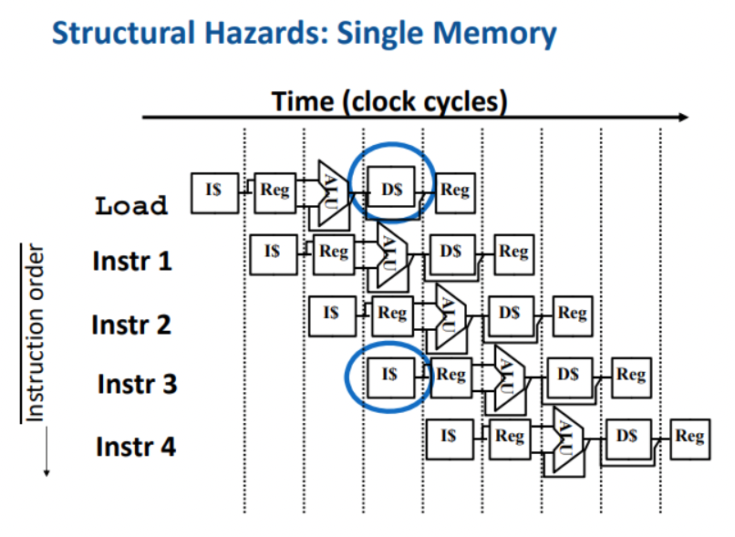
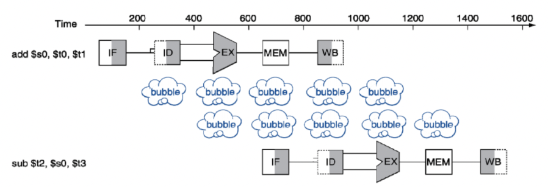
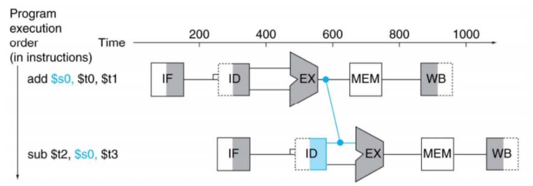
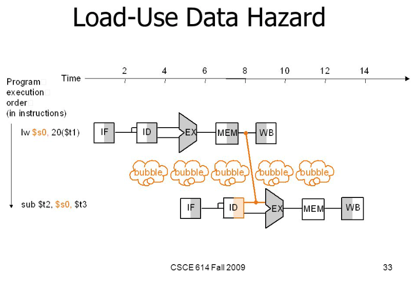
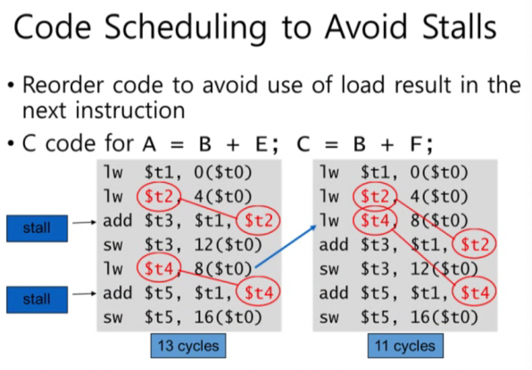
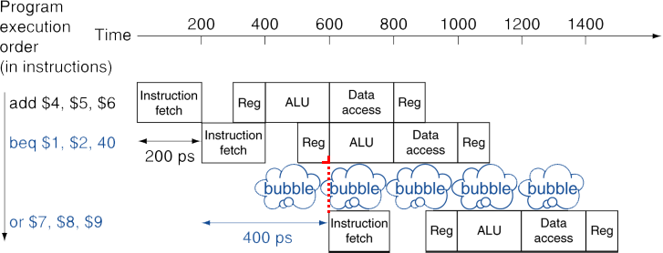
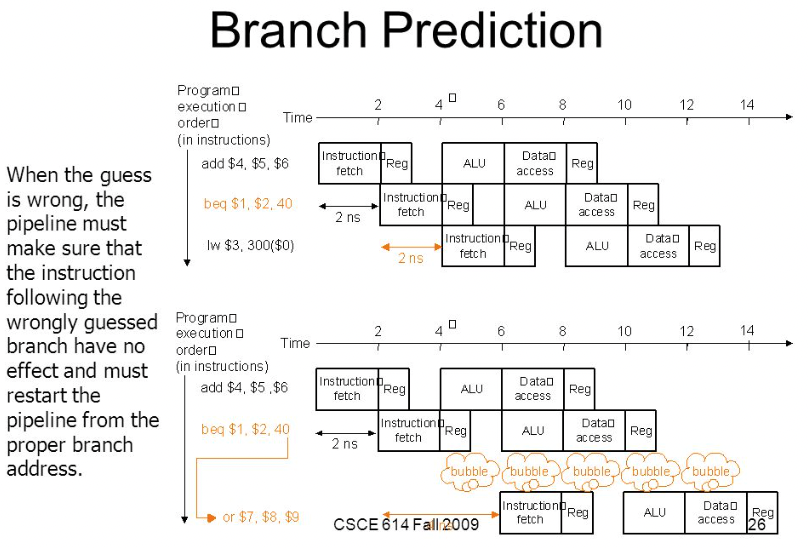

# 4장. 프로세서 (3)

## 1) 파이프라인 해저드
다음 명령어가 다음 클럭 사이클에 실행될 수 없는 상황이 있다. 이러한 사건을 해저드라 부르는데, 총 세 가지 종류가 있다.
- 구조적 헤저드
- 데이터 해저드
- 제어 해저드


### 1-1) 구조적 헤저드
주어진 클럭 사이클에 실행되도록 되어있는 명령어 조합을 하드웨어가 지원하지 못해서 계획된 명령어가 적절한 클럭 사이클에 실행될 수 없는 시간



- 리소스 사용이 충돌이 나서, 다음 사이클 명령어를 실행하지 못하는 경우
- MIPS 싱글 메모리로 있을 경우(단, instruction memory 와 data memory 가 분리되어 있으면 괜찮다)
  - Load/store 도 data access 해야할 경우
  - 다음 명령어를 fetch 하게 될 경우, 앞에있는 Load/store 명령이 끝나야 됨으로, 멈춰진다.
- 파이프라인 데이터 패스에서 instruction memory 와 data memory 를 구분한다. (resource 를 추가하면 된다)
- 즉, 더 많은 리소스를 추가해서 구조를 변경하면 구조적 해저드를 해결할 수 있다.


### 1-2) 데이터 해저드
어떤 단계에서 다른 단계가 끝나기를 기다려야 하기 때문에 파이프라인이 지연되어야 하는 경우 일어난다.
```shell
add $s0, $t0, $t1 
sub $t2, $s0, $t3

위 MIPS 명령어를 보면, 
$s0 값은 add 명령어가 끝나야만 값이 도출되고, 
그 값을 sub 명령어에서 사용할 수 있다.
```


ID 와 WB 를 같은 단계에 놓을 수 있는 이유는?
- 둘이 같은 레지스터를 액세스하는 것이기 때문이고 100ps 이기 때문이다.
- 추가로 더 설명하면?
- 쓰려는 값 자체가 sub 가 쓰려는 값과 동일하기 때문이고,
- 레지스터는 빠르기 때문에 write 를 클럭의 절반 시간동안 하는 것이 가능하기 때문이다.
> 그래서 data dependency 에 의해서 두 사이클을 기다려야 한다.

데이터 해저드는 총 3 종류로 나뉜다.
1. RAW : Read After Write (true dependency)
    - 앞 명령어에서 사용한 데이터를 아직 한 파이프가 다 돌지 못하여 write 되지 않은 상태라,
    - 변경되지 않은 데이터를 사용할 수 없으므로 기다린다.
    - 데이터 디펜던시에 의해 생겨난다.
2. WAW : Write After Write (output dependency)
    - 2가지 일이 같이 일어나 같은 공간에 먼저 쓰인 데이터가 사라지는 것
3. WAR : Write After Read (Anti - dependency)
    - 2가지 일이 같이 일어나 의존성이 있는 관계 데이터들이 일의 순서에 따라 결과가 달라진다.

> 여기서 2, 3번은 싱글코어 프로세서에서는 일어날 수 없는 일이다. <br>
> 멀티코어 프로세서는 어려우니까 전문적으로 배우고, 1을 없앨 방법을 생각해봐야 한다.

<br>

#### 1-2-1) 데이터 해저드 해결 방법
1. 구조적 해저드처럼 'stall' 을 쓰자. (멈춘다는 것이다)
   - 하지만, 이 방법은 오버헤드가 크다
2. 클럭 한 개에서 앞 쪽 반을 write, 뒤 쪽 반을 read 로 바꾸면 어떨까?
    - 이 또한 한계까 존재한다. 처리율을 좀 더 좋게 만들었지만, 한계에 봉착한다.
3. 전방전달(forwarding) 또는 우회전달(bypassing) 을 사용한다.
   - 이 방법은 획기적이다. 이 방법에 대해서 자세히 알아보자.

#### 1-2-2) forwarding OR bypassing
결과 값이 나오자마자, 해당 값을 바로 사용한다는 것을 의미한다. <br>

포워딩으로 피하는 방법은 2가지가 있다.
- wire 를 이어 물리적 측면으로 피하기 
- 코드를 짜서 피하기 (code scheduling to avoid stalls)



두 스테이지를 기다리지 않고, EX 가 끝나면 결과 값이 나오기 때문에 WB 까지 가지 않고도 다음 명령어에 그 값을 사용할 수 있다는 말이다.
- 이 방법은 데이터패스에 추가적 연결이 필요한 방법이다. (하드웨어 필요)

#### 1-2-3) Load-Use Data Hazard(완벽하게 stall 을 없앨 수 없다.)
추가로 Load 를 사용할 때 해저드가 존재한다. <br>
왜 구분하느냐 ?<br>
위에서 설명한 포워딩을 사용을 하더라도, 'stall' 을 완전 피할 수는 없기 때문에 확인 해야한다.



로드 명령어는 MEM 에서 결과값을 얻을 수 있다. <br>
결국 위 그림처럼, 데이터는 MEM 스태이지에서 레지스터로 들어오게 되는데, <br
다음 명령어 EX 단계에서 전 명령어 데이터가 필요하니, 어쩔 수 없이 버블 현상(한 사이클 쉼)이 생긴다.

#### 1-2-4) Code Scheduling to Avoid Stalls
코드를 짜서, stall 피할 수 있다.


코드 명령어 순을 변경한다.
미리 lw를 다 해놓는다. data dependency 가 발생하지 않게끔 하여, 사이클 수를 줄인다.


### 1-3) 제어 해저드
다른 명령어들이 실행 중에 한 명령어의 결과 값에 기반을 둔 결정을 할 필요가 있을 때 일어난다. <br>

가장 대표적인 예가 브랜치 명령어이다.
> branch 로 가야 그 다음 명령어가 무엇인지 알 수가 있다. <br>
> 조건에 부합하면, target address 로 가는 것이고, 아니면 그냥 다음 명령어가 실행된다. <br>
> 적, branch 다음에 오는 명령어가 명확하게 하지 않으면 오작동할 수 있다.<br>
> 그래서 원래 파이프라인은 EX 스테이지에서 알수 있는 걸, MIPS 에서는 ID 스테이지에서 장치를 추가하여 target address 를 구하게 했다.



위 그림처럼, ID 스테지이에 하드웨어를 추가하여 미리 비교를 하고 주소를 계산했더라도, ID 스테이지가 끝나야 알 수 있다 <br>
따라서, 1 사이클 stall 이 발생한다.

> 정리하면, EX 스테이지에서는 2사이클 stall 이 발생했다면, 하드웨어 추가로 ID 스테이지에서 알 수 있게 했더라도 1사이클 stall 이 생길 수 밖에 없다.<br>
> 이것이 control hazard 다.

#### 많은 연구자들이 branch 에서 발생하는 control 해저드를 개선하기 위해 여러가지 방법을 제안했다.

#### 1-3-1) 분기 예측(branch prediction)
프로세스 스피드업을 위해선, 파이프라인 스태이지 수와 비례한다 <br>
스태이지 수는 최신 프로세스는 12/16/24... 생각보다 스태이지 수가 많다.<br>

스태이지 수가 그 만큼 많을수록 분기 명령어 결과를 중간에 알게되고, 그 stall 패널티가 아주 길어진다. <br>

그래서 브랜치 결과를 예측을 하는 방법을 찾았다.

> 브랜치 예측을 해서, 맞으면 진행되니 stall 이 발생되지 않고 틀리면 stall 을 발생시키면 된다.



하지만, 브랜치 예측도 아무렇게나 하지 않다. 아래 두 가지 브랜치 예측을 확인해보자.

*두 가지의 브랜치 예측*
- 정적(static) 브랜치 예측 : 예측이 고정되어 있다.
- 동적(dynamic) 브랜치 예측 : 최근 실행 결과 바탕(history)으로 예측 한다. (history 를 저장하는 메모리 장치가 필요)

#### 1-3-2) 정적 브랜치
전형적인 브랜치 동작을 기본으로한다.
- 되돌아가는(backward, 위로) : 브랜치는 일어날 것으로 예쌍한다. 해당 주소의 IF
- 진행하는(forward, 아래로) : 브랜치는 일어나지 않을 것으로 예쌍한다. PC+4 의 IF (*정확도는 떨어질 수 있다.)

#### 1-3-3) 동적 브랜치
하드웨어가 실제 브랜치 동작을 측정한다. (브랜치의 최근 기록을 기록한다.)
- 미래 동작을 예측해 그게 틀린다면, 그 때는 stall 발생하고 아니면 re-fetching 이 일어남
- 히스토리는 잘되던 못되던 항상 기록, stall 이 발생하면 점차 수정되어 히스토리 트렌드도 변할 것 (*정확도는 높지만, 히스토리 기록과 트렌드 측정에 자원과 시간소요

## 파이프라인 요점 정리
파이프라이닝은 동시에 실행되는 명령어의 수를 증가시키며 명령어들이 시작하고 끝나느 속도를 증가시킨다.<br>

파이프라인은 각각의 명령어의 실행이 끝나는 데 걸리는 시간을 단축시키지는 않는데 이 시간을 지연시간이라 부른다.
- 지연 시간 : 파이프라인의 단계 수 또는 실행 중인 명령어 사이의 단계 수
파이프 라이닝은 각각의 명령어 지연시간보다는 처리율을 향상 시킨다.

어떤 명령어 체계를 사용하느냐에 따라 파이프라인 구현에 영향을 미치게 된다.
- MIPS, ARM 의 RISC 계열의 프로세서는 파이프라인을 구현하기 쉽다
- 반면에, CISC 계열의 프로세스는 파이프라인을 구현하기 어렵다.


