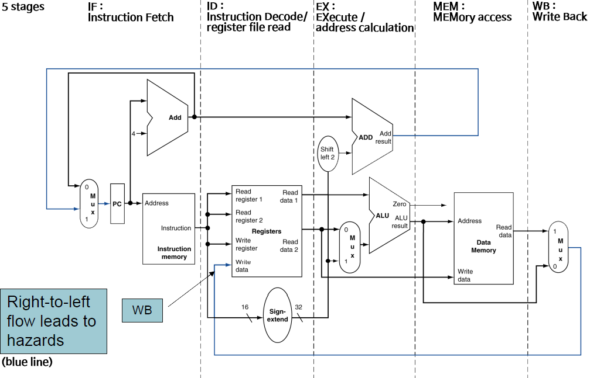
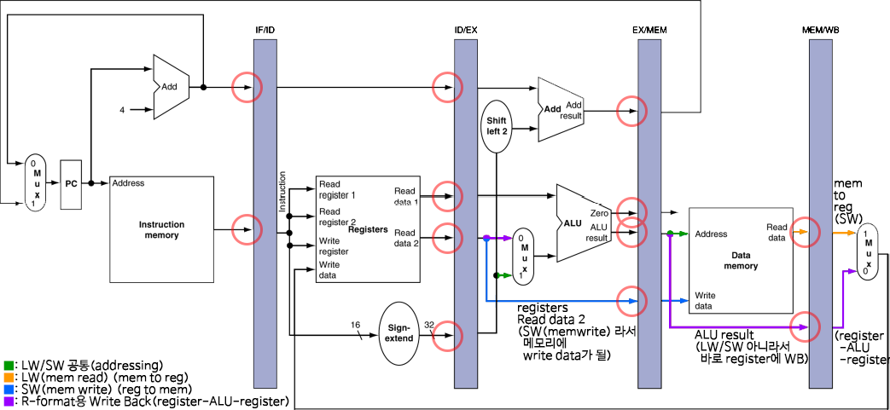
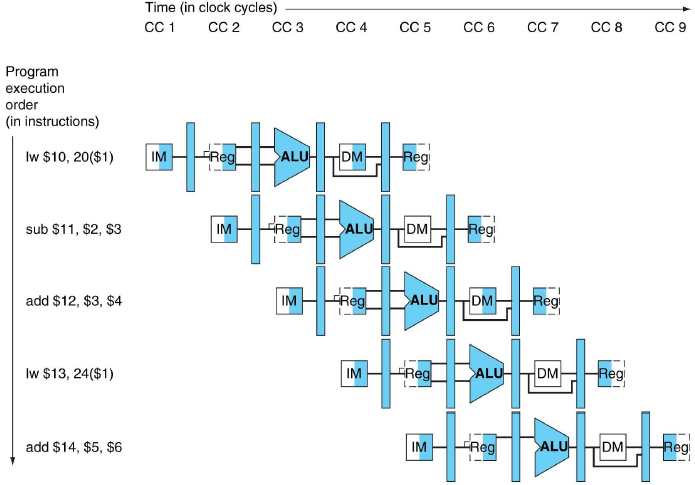
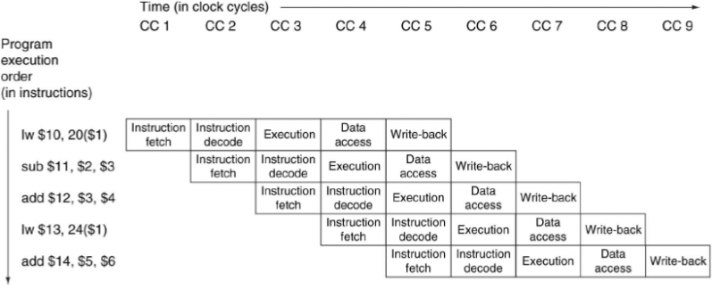
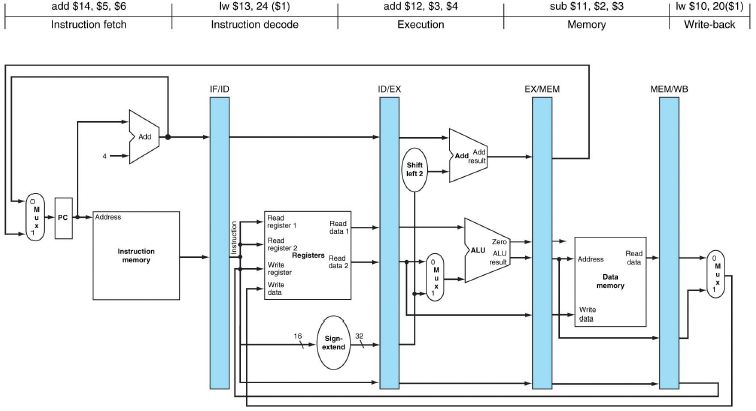
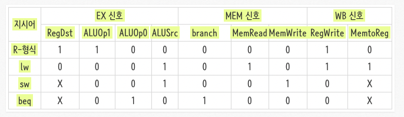
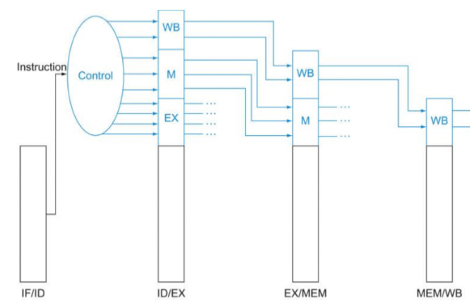
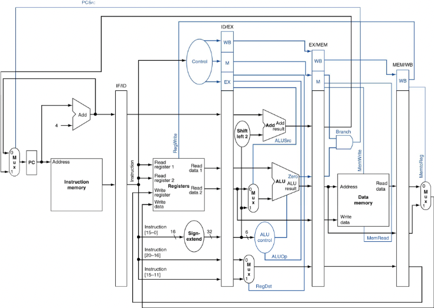

# 4장. 프로세서 (4)

### MIPS Pipelined DataPath

Multi(pipelined) 개략도이다.

### Pipeline registers
이전 사이클에서 만들어진 정보를 가지고 있어야 하기 때문에 각 stage 사이에 레지스터가 필요하다.

### Pipeline Operation
파이프라인 데이터패스를 볼 때, 두 가지로 그림을 그린다. 
- 싱글 클럭 사이클 파이프라인 다이어그램 : 특정한 한 사이클의 파이프라인 을 보여준다.
- 멀티 클럭 사이클 다이어그램 : 여러 사이클의 거쳐서 어떤식으로 실행이 되는 지 보여준다.

### IW 명령어 시간 흐름별 수행과정 (그림 생략)
1. IF 단계 : MUX, PC, Adder, Instruction memory 활성화
2. ID 단계 : Register 의 Read data1,2 그리고 Sign-extend 활성화
3. EX 단계 : Mux, ALU 활성화
4. MEM 단계 : Data Memory, Read data 활성화
5. WB 단계 : Mux 와 Register 의 Write reg, data 활성화 => 데이터 해저드 유발

> lw 명령어에서 타겟 레지스터 값은 ID 스테이지에서 결정된다  
> 하지만, 실제 데이터가 씌여지는 건, WB 에서 씌여진다.  
> 정리하자면, 우리가 실행한 lw가 WB stage 에 가 있다는 건 다른 명령어가 ID 스테이지에 있고 그 명령어에 의해서 타겟 어드레스가 결정된다.  
> 즉, 엉뚱한 데이터가 ID 에 들어갈 수 있다  
> 따라서, 타겟 레지스터를 파이프라인을 계속 보내주어야 한다.
  

### Multi-Cycle Pipeline Diagram

멀티 사이클 파이프라인 다이어그램을 보면, 시간에 지나 사이클이 증가함에 따라, 어떤 명령어가 어떤 스태이지에 실행되는 지 그림을 보면 쉽게 이해할 수 있다.

위 그림은, 그 윗 그림과는 동일한 다이어그램이지만, 스태이지 명을 적어 놓은 것이다.

### Single-Cycle Pipeline Diagram

- 단일 클럭에서의 전체 데이터패스의 상태
- 멀티 클럭 사이클 다이어그램의 vertical slice 를 보여줌 
- 여러 사이클동안의 pipeline 동작을 보이기 위해서 여러 다이어그램으로 이루어진 그룹으로 제시됨

> 단일 방식에선 10개의 신호를 동시에 발사했지만, 파이프라인 도입으로 인해 이제는 부분 별로 제어신호를 발사해야 한다.

### 각 단계별 제어 신호(제어신호를 제어하는 제어신호)
- IF : 제어신호 없음 : 항상 같은 작업 수행하기 떄문에 필요 없다.
- ID : 제어신호 없음 : 항상 같은 작업 수행하기 떄문에 필요 없다.
- EX : RegDst(rt, rd 구분), ALUOp(수행연산 종류), ALUSrc(Read, data2, extended 16bit 중 피산자 정하기)
- MEM : Branch(beq), MemRead(lw), MemWrite(sw)
- WB : MemtoReg, RegWrite (rw, lw 일 때만 활성화)

### 각 단계에서 명령어에 따라 각 제어신호들에게 내보내주는 신호

### 파이프라인 레지스터를 통한 제어신호 전달

ID 에서 명령어 해석을 통해 알맞는 Control 들이 생성됨.  

제어신호가 EX => MEM => WB 거치면서 각 자에 필요한 정보는 쓰고 나머지는 다음 꺼에 전달하는 방식

### 최종 파이프라인 컨트롤

각각의 스테이지에 맞게끔 컨트롤을 보내주면서 전체 파이프라인 컨트롤을 보여주는 그림이다.

